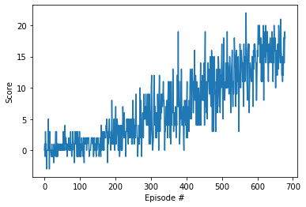

[image1]: https://user-images.githubusercontent.com/10624937/42135619-d90f2f28-7d12-11e8-8823-82b970a54d7e.gif "Trained Agent"

# Project 1: Banana navigation

### Introduction
This projects builds a Reinforcement Learning agent based on a DQNN model that tries to solve the banana collection environment from Unity ML.

It is an implementation of the Deep Q-Learning algorithm with Experience Replay using a 5-steps window of states to train and decide what the next action will be.

### DQN Implementation

Since the goal is not just to train the agent but to train it fast, the training algorithm is limited to finish in `1000 episodes` or less. `Epsilon starts from 1.0 with a decay of 0.995 at every new episode down to a minimum of 0.01`, this allows the agent to initially explore and later on do more exploitation of what it already has learned in the previous training episodes. Within each episode iteration the following steps are executed:

- Restart the environment to its initial state
- Observe the environment state
- The agent is allowed to navigate the environment for at most `2000 steps`
  * Send the current state to the agent `act` function to get the corresponding action
  * Perform the selected action on the environment
  * Observe the new state, the reward, and check if the episode ended (done)
  * Perform an agent training step with the state, action, reward, next_step and done tuple
  * Update current state with the new state of the environment
  * Accumulate the reward
  * If the environment is done the finish the steps loop, otherwise continue
- Decrease Epsilon by 0.995 (until it gets to 0.01)
- If the score of the last 100 episodes is 15 or more we've finished the training

Other hyperparameters are:
Gamma: 0.99
Tau: 1e-3
Learning rate: 5e-4
Batch size: 64
Target network update every 4 steps

### NN Model
The Neural Network Architecture is the following:

- Two stacked RNN layers with 128 hidden units. The input size of this layer is configured to receive 5 contiguous states (instead of just the most recent one).
- A Relu activation layer
- A Linear layer with 256 units
- A Relu activation layer
- A Linear layer with 64 units
- A Relu activation layer
- A Linear layer with 4 units (one per action, this is the output layer)

### Plot of rewards
The rewards obtained during the agent training:

Although the requirement was to obtain a +13 reward, this agent implementation was configured to obtain at least +15. It achieves this goal with 579 episodes!

A trained neural network is included in this repository as well: [DQN](checkpoint.pth)

### Future Work
The agent seems to get a little "undecisive" when it faces more than one yellow banana. It also doesn't seem to go backwards that much. 
It might be interesting to experiment with the following in order to improve this:
- A longer state window
- A bi-directional RNN at the beginning of the network

